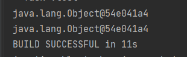
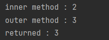

# Prototype

> __멤버변수의 값을 재활용하기 위한__ 생성 패턴

## 단어의 뜻

- `Proto-` + `Type`
- = (`최초의` + `형태`)
- = `원형`

### Class Diagram


## Idiom

### `Cloneable`

> Java 에서 Prototype 구현은 일반적으로 Cloneable 인터페이스를 사용하여,
> Deep Clone 으로 구현하는 암묵적인 약속이 있다.

#### Thin Clone

> Object 클래스의 clone 을 사용하며,
> Reference Key 만을 복사하기에 __사실상 같은 메모리 공간__ 의 데이터에 접근한다. 

```java
public class Thin implements Cloneable {
    
    int numA = Math.random();
    int numB = Math.random();

    @Override
    public Thin clone() {

        try {
            return (Thin) super.clone();
        } catch (CloneNotSupportedException e) {
            throw new AssertionError();
        }
    }
}
```

#### Deep Clone

> 클래스의 clone 을 재정의하며,
> 새로운 Object 메모리공간을 생성한 뒤 Data 값자체를 복사하기에 __서로 다른 메모리 공간__ 의 데이터에 접근한다.

```java
public class Deep implements Cloneable {

    int numA = Math.random();
    int numB = Math.random();

    @Override
    public Deep clone() {
        
        try {
            Deep deep = new Deep();
            deep.numA = this.numA;
            deep.numB = this.numB;
            
            return deep;
        } catch (CloneNotSupportedException e) {
            throw new AssertionError();
        }
    }
}
```

### Thin Clone Syntactic sugar

> Thin Clone 의 경우 `Object.class` 의 native 메소드를 사용하며,
> 사실상 초기화 연산자(`=`)로 간단히 적용될 수 있다. 

```java
class Tests {

    @Test
    void test() {
        Object o1 = new Object();
        Object o2 = o1;

        System.out.println(o1);
        System.out.println(o2);
    }

}
```

#### 출력 결과



### Object 의 Parameter

> 위와 같이 Method 에 전달되는 매개변수도 같은 Reference 를 바라보며,
> 어디서 수정하던 동일한 메모리공간을 수정하므로 실질적으로 변경된 Object 의 반환이 필요없다.

```java
class Tests {

    @Test
    void test() {
        Data data = new Data();
        data.i = 2;
        Data returned = change(data);
        System.out.println("outer method : " + data.i);
        System.out.println("returned : " + returned.i);
    }

    public Data change(Data data) {
        System.out.println("inner method : " + data.i);
        data.i = 3;
        return data;
    }

    class Data {
        public int i = 1;
    }

}
```

#### 출력 결과




### 사용 예시


```java
public class Application {

    Spaceship ship = new Spaceship();
    
    public static void main(String[] args) {

        Thread thread = new Thread(new SpaceshipTracker(ship));

        // add interrupt in clone() for copy;
        Position current = pos.clone();
    }

    public class SpaceshipTracker implements Runnable {

        private Spaceship ship;

        public SpaceshipTracker(Spaceship ship) {
            this.ship = ship;
        }

        @Override
        public void run() {
            while (true) {
                Thread.sleep(1000);
                sync();
            }
        }
        
        private void sync () {
            // Update Spaceship Information
        }

    }
}
```