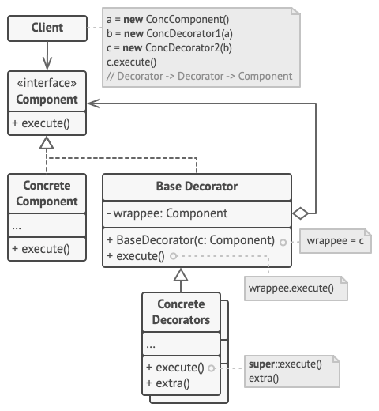

# Decorator Pattern

## 시나리오
-- --

- `Decorator Pattern` 을 설명 하기에 앞서 한가지 시나리오에 대해 살펴 보자.
- `Caffe`에서 음료를 커스텀하여 주문 하는 앱을 만든다고 가정 하자.

```
abstract class Beverage {
    String description
    
    getDescription()
    cost()
}

Class Americano extends Beverage {
    ...
    cost()
}

Class CafeLatte extends Beverage {
    ...
    cost()
}
        
```

위와 같이 상속의 관계로 구조를 설계 하면 `샷추가`, `휘핑크림 추가` 와 같은 커스텀 옵션에 대해서 `AmericanoWithEspresso`, 
`AmericanoWithWhippingCream`, `CafeLatteWithEspresso`, `CafeLatteWithWhippingCream` 과 같이
메뉴 별로 엄청 나게 많은 서브 클래스를 생성 해야 한다.
또한, `샷추가`, `휘핑크림`의 가격이 상승 하게 되면 모든 서브 클래스의 `cost`를 수정 해야 하는 상황이 발생 한다.


```
abstract class Beverage { 
    String description
    Espresso espresso
    Milk milk
    WhippingCream whippingCream

    getDescription()
    getEspresso()
    setEspresso()
    getMilk()
    setMilk()
    getwhippingCream()
    setwhippingCream()
    cost()
}

class Americano extends Beverage{
  ...
  cost() //Americano 음료 가격에서 수퍼클래스의 cost()를 호출하여 추가 요금을 더함.
}
```

위와 같이 구현을 하게 되면 수퍼클래스에서 추가된 커스텀 옵션 가격 까지 계산을 해주기 때문에 `~WithEspresso`, `~WithWhippingCream`과 
같은 서브클래스는 만들지 않아도 된다.
하지만 아직 몇가지 문제가 남아있다.
- `커스텀 옵션`이 많아 지면 `새로운 메소드` 추가 하고 `cost()` 메소드도 수정 해야 함.
- `Espresso` `투샷`, `쓰리샷` 과 같은 옵션도 새로운 `커스텀 옵션`으로 추가 해야 함. 
- `커스텀 옵션`이 필요 없는 `음료`의 경우 필요 없는 `메소드`를 상속 받게 됨.

## OCP(Open-Closed Principle) 원칙 / 개방 폐쇄 원칙
-- -- 
> 소프트웨어 개체(클래스,모듈,함수)는 `확장`에 대해 열려 있어야 하고, `수정`에 대해서는 닫혀 있어야 한다.

`Beverage` 클래스를 확장하여 `BubbleTea` 클래스를 새로 만드는 건 가능하지만,
`BubbleTea`에 `펄 추가` 옵션이 필요하다고 해서, `Beverage` 클래스에 마음대로 `펄 추가` 옵션 관련 사항을
추가하게 되면 `Beverage` 클래스를 상속받는 다른 클래스에서 버그가 발생할 수 있다.


## Decorator Pattern 이란?
-- --

- `장식`과 `실제 내용물`을 동일시
- `객체`에 동적으로 `책임`을 추가

## Class Diagram
-- --



- `Component` 동적으로 추가할 서비스를 가질 수 있는 객체 정의
- `ConcreteComponent` 추가적인 서비스가 필요한 실제 객체
- `BaseDecorator` Component의 참조자를 관리하면서 Component에 정의된 인터페이스를 만족하도록 정의
- `ConcreteDecorator` 새롭게 추가되는 서비스를 실제 구현한 클래스

## 예제
-- --


### Beverage.java
```java
public interface Beverage {

  public abstract void brewing();
  public abstract int cost();
}
```

### ColdBrew.java
```java
public class ColdBrew implements Beverage {

  @Override
  public void brewing() {

    System.out.print("ColdBrew.. ");
  }

  @Override
  public int cost() {

    return 3000;
  }
}
```

### EthiopiaEspresso.java
```java
public class EthiopiaEspresso implements Beverage {

    @Override
    public void brewing() {

        System.out.print("EthiopiaEspresso.. ");
    }

    @Override
    public int cost() {

        return 2500;
    }
}
```

### KenyaEspresso.java
```java
public class KenyaEspresso implements Beverage {

  @Override
  public void brewing() {

    System.out.print("KenyaEspresso.. ");
  }

  @Override
  public int cost() {

    return 3000;
  }
}
```

### Decorator.java
```java
public abstract class Decorator implements Beverage {

  Beverage beverage;
  public Decorator(Beverage beverage){
    this.beverage = beverage;
  }

  @Override
  public void brewing() {
    beverage.brewing();
  }

}
```

### ColdWater.java
```java
public class ColdWater extends Decorator {

  public ColdWater(Beverage beverage) {

    super(beverage);
  }

  @Override
  public void brewing() {

    super.brewing();
    System.out.print("Adding Cold Water.. ");
  }

  @Override
  public int cost() {

    return beverage.cost();
  }
}
```

### Honey.java
```java
public class Honey extends Decorator{

  public Honey(Beverage beverage) {

    super(beverage);
  }

  @Override
  public void brewing() {

    super.brewing();
    System.out.print("Adding Honey.. ");
  }

  @Override
  public int cost() {

    return 500 + beverage.cost();
  }
}
```

### HotWater.java
```java
public class HotWater extends Decorator {

  public HotWater(Beverage beverage) {

    super(beverage);
  }

  @Override
  public void brewing() {

    super.brewing();
    System.out.print("Adding Hot Water.. ");
  }

  @Override
  public int cost() {

    return beverage.cost();
  }
}
```

### Ice.java
```java
public class Ice extends Decorator {

  public Ice(Beverage beverage) {

    super(beverage);
  }

  @Override
  public void brewing() {

    super.brewing();
    System.out.print("Adding Ice.. ");
  }

  @Override
  public int cost() {

    return 500 + beverage.cost();
  }
}
```

### Milk.java
```java
public class Milk extends Decorator{

  public Milk(Beverage coffee) {

    super(coffee);
  }

  @Override
  public void brewing() {

    super.brewing();
    System.out.print("Adding Milk.. ");
  }

  @Override
  public int cost() {

    return 1000 + beverage.cost();
  }
}
```

### VanillaSyrup.java
```java
public class VanillaSyrup extends Decorator{

  public VanillaSyrup(Beverage coffee) {

    super(coffee);
  }

  @Override
  public void brewing() {

    super.brewing();
    System.out.print("Adding Vanilla Syrup.. ");
  }

  @Override
  public int cost() {

    return 500 + beverage.cost();
  }
}
```

### WhippedCream.java
```java
public class WhippedCream extends Decorator {

  public WhippedCream(Beverage beverage) {

    super(beverage);
  }

  @Override
  public void brewing() {

    super.brewing();
    System.out.print("Adding Whipped Cream.. ");
  }

  @Override
  public int cost() {

    return 500 + beverage.cost();
  }
}
```

### InputStream Class Diagram


## 결론
-- --

### 장점
- `상속`을 사용하지 않고 기능의 `유연한 확장`이 가능
- `객체`에 동적으로 `새로운 서비스`를 `추가` 할 수 있음
- 전체가 아닌 `개별적인 객체`에 `새로운 기능`을 `추가` 할 수 있음

### 단점
- 의미없는 자잘자잘한 `객체`들이 많아질 수 있음
- 코드가 필요 이상으로 복잡해져 `가독성`이 떨어짐

### `Composite Pattern` 와 `Decorator Pattern` 의 비교

- 재귀적으로 순환하는 방식은 공통적임
- `Composite Pattern` 은 여러 개로 구성된 클래스들이 `동일한 형태`로 구성될 수 있도록 `구조화`하는데 목적
- `Decorator Pattern` 은 기능을 클래스화 함으로 `동적`으로 기능을 추가하거나 삭제할 수 있도록 하는데 목적
- `Composite Pattern` 와 `Decorator Pattern`은 동시에 사용하여 `상호보완적인 역할`을 기대할 수도 있음

## 참조
- https://refactoring.guru/ko/design-patterns/decorator
- Head First Design Patterns
