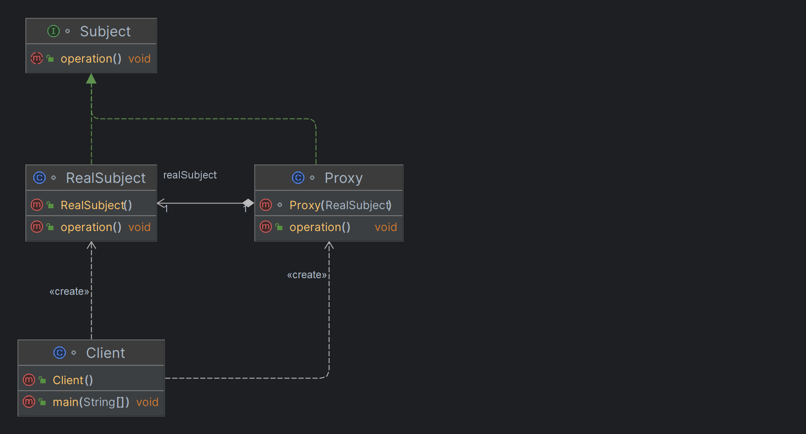

# Proxy Pattern

### 프록시 패턴이란
- 대상 원본 객체를 대리하여 대신 처리하게 함으로써 로직의 흐름을 제어하는 행동 패턴
- 클라이언트가 대상 객체를 직접 쓰는게 아니라 중간에 프록시(대리인)을 거쳐서 쓰는 코드 패턴

### 다양한 Proxy
* 가상 프록시(Virtual Proxy)
* 원격 프록시(Remote Proxy)
* 보호 프록시(Protection Proxy, Access Proxy)

## Class Diagram
-- --


- `Subject` Proxy 와 RealSubject 모두 Subject 인터페이스를 구현해야 함
- `RealSubject` 진짜 작업을 대부분 처리하는 원본 대상 객체
- `Proxy` 원본 대상 객체로의 접근을 제어하는 대리인
- `Client` Proxy 객체로 데이터를 주고받는 클라이언트

## 예제
-- --
#### Subject.java
```java
interface Subject {
    void operation();
}

class RealSubject implements Subject {
    @Override
    public void operation() {
        System.out.println("원본 객체 실행 !!");
    }
}
```
#### Proxy.java
```java
class Proxy implements Subject {
    private final RealSubject realSubject;

    Proxy(RealSubject realSubject) {
        this.realSubject = realSubject;
    }

    @Override
    public void operation() {
        System.out.println("=== Logging Proxy - Start ===");

        realSubject.operation();

        System.out.println("Proxy - 별도의 로직 실행 !!");

        System.out.println("=== Logging Proxy - End ===");
    }
}

class Client {
    public static void main(String[] args) {
        // 원본 객체 실행
        Subject realSubject = new RealSubject();
        realSubject.operation();

        System.out.println();

        // Proxy 를 거쳐서 실행
        Subject proxy = new Proxy(new RealSubject());
        proxy.operation();
    }
}
```
### 가상 프록시(Virtual Proxy)
- 지연 초기화 방식
- 서비스가 시작될 때 객체를 생성하는 대신에 객체 초기화가 실제로 필요한 시점에 초기화
- 실제 객체의 생성에 많은 자원이 소모 되지만 사용 빈도는 낮을 때 쓰는 방식

### 관련 패턴
-- --
> **Decorator 패턴**
> 
> 종종 `프록시`와 `데코레이터` 패턴이 똑같아 보이기도 하는데, `용도`나 `목적`으로 구분할 수 있다.   
> - `데코레이터`: 클래스에 새로운 행동을 추가하는 용도로 쓰인다. (샷 추가, 휘핑크림 추가)
> - `프록시`: 어떤 클래스로의 접근을 제어하는 용도로 쓰인다.

### 장점


### 단점
- 새로운 클래스들을 많이 도입해야 하므로 코드가 복잡해질 수 있음

## 참조
- 헤드 퍼스트 디자인 패턴